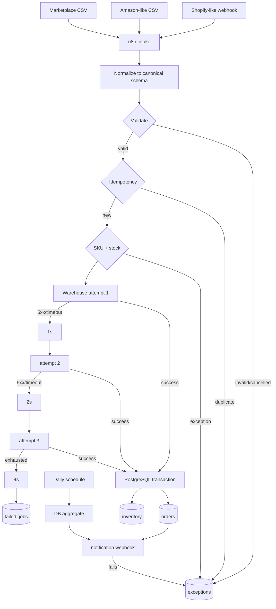

# E-commerce Order & Inventory Exception Automation

A production-oriented **n8n e-commerce operations portfolio** built around failure handling, idempotency, inventory safety, and auditability rather than only happy-path node chaining.

It normalizes Shopify-like webhook payloads and two marketplace CSV schemas, rejects permanent business errors, protects against duplicate processing, checks stock, retries temporary warehouse failures, dead-letters exhausted jobs, records exceptions, and sends a database-derived daily summary.

> **Synthetic data only.** Every order, email, SKU, inventory value, failure, and result in this repository is fabricated for demonstration. This repository makes no production ROI, accounting, tax, or real-client claims.

## Problem

Multi-channel order operations commonly fail in ways that basic automations hide:

- different source columns and payload shapes
- duplicate webhooks / duplicate CSV rows
- cancelled orders mixed into paid orders
- missing or unknown SKUs
- invalid quantities and currencies
- insufficient warehouse stock
- temporary API 500 / timeout failures
- retries that accidentally create duplicate state
- successful DB writes followed by notification failure
- no exception queue or dead-letter trail
- summary reports that do not reconcile to stored data

This demo treats those as first-class workflow states.

## Architecture



Detailed design: [`docs/architecture.md`](docs/architecture.md)

## Reliability features

- **Canonical schema** with explicit per-source mapping inside n8n.
- **Idempotency key:** `source + ':' + external_order_id`.
- **Defense in depth:** workflow pre-check plus `orders.order_key UNIQUE`.
- **Transactional inventory:** `SELECT ... FOR UPDATE`, inventory decrement, and order insert are one PostgreSQL function transaction.
- **Permanent vs temporary failure classification:** validation/4xx are not retried; 5xx/timeouts are.
- **Bounded retry chain:** attempt 1 → wait 1s → attempt 2 → wait 2s → attempt 3 → wait 4s → dead-letter.
- **Post-commit notification isolation:** a notification failure records `NOTIFICATION_FAILURE` instead of rolling back a valid order.
- **Audit trail:** `exceptions`, `failed_jobs`, `processed_events`, `workflow_runs`.
- **Global workflow error handler:** unexpected n8n execution errors route to a separate failure workflow.
- **Database-derived daily summary:** no hard-coded demo totals.

## Canonical order schema

```json
{
  "source": "shopify",
  "external_order_id": "SHOP-10001",
  "order_key": "shopify:SHOP-10001",
  "customer_email": "demo01@example.com",
  "sku": "SKU-RED-001",
  "quantity": 2,
  "unit_price": 10100,
  "currency": "KRW",
  "order_status": "paid",
  "created_at": "2026-09-01T09:00:00+09:00"
}
```

## Repository

```text
n8n-ecommerce-ops-automation/
├─ README.md
├─ docker-compose.yml
├─ .env.example
├─ workflows/
│  ├─ ecommerce-order-intake.json
│  ├─ ecommerce-error-handler.json
│  └─ ecommerce-daily-summary.json
├─ mock-api/
│  ├─ package.json
│  ├─ src/server.ts
│  ├─ dist/server.js
│  └─ README.md
├─ db/
│  ├─ schema.sql
│  └─ seed.sql
├─ fixtures/
│  ├─ shopify_orders.json
│  ├─ amazon_orders.csv
│  ├─ marketplace_orders.csv
│  ├─ inventory.csv
│  └─ sku_master.csv
├─ scripts/
│  ├─ generate_fixtures.py
│  ├─ generate_workflows.py
│  ├─ send-webhook.sh / .ps1
│  ├─ send-all-fixtures.py
│  ├─ run-smoke.sh / .ps1
│  ├─ smoke_harness.py
│  ├─ verify-results.py
│  └─ verify-workflows.mjs
├─ docs/
│  ├─ architecture.md
│  ├─ failure-scenarios.md
│  ├─ portfolio-case-study.md
│  ├─ demo-video-script.md
│  └─ application-intro.md
├─ screenshots/
└─ generated/
```

## Tech stack

- n8n **2.37.10 stable** reference version
- PostgreSQL **17.11** / Supabase-compatible SQL
- Node.js 22 mock API
- TypeScript source with dependency-free prebuilt JS runtime
- Python 3 standard-library smoke harness
- Docker Compose for reproducible local topology

The n8n Docker image is pinned rather than using a floating tag. n8n recommends the Stable release track for mission-critical workloads. The workflow uses Postgres query parameters instead of interpolating raw payload values into SQL. See n8n's current security audit guidance for SQL-expression/query-parameter review.

## Quick start — deterministic smoke test

This test does **not** require Docker, external SaaS, Google, Slack, or npm packages.

### Windows PowerShell

```powershell
cd n8n-ecommerce-ops-automation
.\scripts\run-smoke.ps1
```

If Windows PowerShell 5.1 blocks local scripts, enable them only for the current shell:

```powershell
Set-ExecutionPolicy -Scope Process Bypass
```

Repository JSON/workflow files are UTF-8 **without BOM**. On Windows PowerShell 5.1, avoid rewriting JSON with `Set-Content -Encoding UTF8`, which adds a BOM; use a BOM-less UTF-8 writer instead.

### macOS / Linux / Git Bash

```bash
cd n8n-ecommerce-ops-automation
./scripts/run-smoke.sh
```

Expected checks:

```text
Test A — Normal order: PASS
Test B — Duplicate webhook: PASS
Test C — Unknown SKU: PASS
Test D — Insufficient inventory: PASS
Test E — Temporary API failure: PASS
Test F — Permanent/exhausted API failure: PASS
Test G — Cancelled order: PASS
Test H — Re-run safety: PASS
Test I — Daily summary reconciliation: PASS
```

The machine-readable report is written to `generated/smoke-report.json`. Full verification notes: [`docs/test-results.md`](docs/test-results.md).

## Full n8n + PostgreSQL setup

1. Copy environment values:

```bash
cp .env.example .env
```

On PowerShell:

```powershell
Copy-Item .env.example .env
```

2. Change at least `N8N_ENCRYPTION_KEY` and `POSTGRES_PASSWORD` in `.env`.

3. Start the stack:

```bash
docker compose up -d
```

### PostgreSQL 16 -> 17 local demo reset

The PostgreSQL 17 upgrade intentionally uses a new Compose volume key, `postgres17_data`. This avoids trying to open a PostgreSQL 16 data directory with PostgreSQL 17. Because this repository contains synthetic demo data, the new PostgreSQL 17 volume is initialized from `db/schema.sql` and `db/seed.sql`. The previous `postgres_data` volume is left untouched for rollback/inspection and may be removed manually only after the PostgreSQL 17 demo is verified. n8n database state stored in the old PostgreSQL volume is not migrated automatically, so workflows/credentials must be re-imported/recreated for the post-upgrade regression run.

4. Import the workflows:

```bash
docker compose exec -T n8n n8n import:workflow --input=/workflows/ecommerce-order-intake.json
docker compose exec -T n8n n8n import:workflow --input=/workflows/ecommerce-error-handler.json
docker compose exec -T n8n n8n import:workflow --input=/workflows/ecommerce-daily-summary.json
```

5. In n8n, create one **Postgres** credential pointing to the `ecommerce_ops` database and attach it to all Postgres nodes. The workflow JSON intentionally contains no credential ID, password, or API key.

6. Set `E-commerce Ops - Global Error Handler` as the error workflow for the intake workflow, then publish/activate the required workflows.

7. Send one fixture:

```powershell
.\scripts\send-webhook.ps1
```

Or send all 42 synthetic rows after the intake webhook is active:

```bash
python scripts/send-all-fixtures.py
```

## Supabase mapping

The SQL in `db/schema.sql` runs on PostgreSQL and is suitable for a Supabase PostgreSQL database. For a Supabase-backed delivery:

- run `schema.sql` and `seed.sql` in a non-production project first
- configure an n8n Postgres credential using the Supabase connection details
- keep credentials in n8n's credential store, not workflow JSON
- review network access, SSL mode, connection pooling, RLS/service-role boundaries, and retention before production use

## Synthetic fixture coverage

The corpus contains **42 deterministic rows** across the three source schemas. It includes:

- normal webhook orders
- normal CSV orders
- repeated SKUs across orders
- duplicate Shopify delivery
- duplicate Amazon CSV order
- cancelled orders
- missing SKU
- unknown SKU
- zero / negative quantity
- insufficient stock
- malformed email
- missing order field
- invalid currency
- non-numeric CSV quantity
- fail twice then succeed
- always-500
- timeout
- post-commit notification failure

See [`docs/failure-scenarios.md`](docs/failure-scenarios.md).

## Verified synthetic results

### Deterministic repository harness

Generated from the 42 repository fixtures:

| Metric | Result |
|---|---:|
| Fixture rows | 42 |
| Orders processed | 26 |
| Successful | 26 |
| Cancelled | 3 |
| Exceptions | 17 |
| Duplicates ignored | 2 |
| Retry recovered | 1 |
| Dead-letter jobs | 2 |

All Tests **A-I pass** in the deterministic contract harness. The harness replays the complete dataset against a cloned database and verifies that order count and inventory remain unchanged.

### Live n8n/PostgreSQL pre-upgrade baseline

A prior real local demo run against n8n + PostgreSQL + the mock API also completed Tests **A-I (9/9)** with these database-derived totals:

| Metric | Result |
|---|---:|
| Successful orders | 5 |
| Exceptions | 9 |
| Cancelled | 1 |
| Duplicates ignored | 2 |
| Retry recovered | 1 |
| Permanent failures | 4 |

The daily-summary workflow returned the same six values as the database aggregate. These are synthetic demo results, not customer/production metrics. They are retained as the **pre-upgrade live baseline** only. After the PostgreSQL 17.11 / n8n 2.37.10 change, a fresh P13 live regression is required before calling the upgraded runtime PASS.

### Verification scope

- **Repository harness:** mock API runtime, all 42 fixtures, validation/idempotency/inventory/retry/dead-letter logic, notification failure, re-run invariants, DB-derived summary, workflow JSON structural/security checks.
- **Historical live baseline:** actual n8n/PostgreSQL/mock-API execution before the P12 runtime upgrade.
- **Current runtime target:** PostgreSQL 17.11 + n8n 2.37.10.
- **Still required:** post-upgrade P13 live import/execution regression.

`generated/smoke-report.json` records the deterministic contract harness result and does not claim to be a production/Supabase deployment.

## Exception codes

| Code | Meaning | Retry |
|---|---|---:|
| `DUPLICATE_ORDER` | already processed idempotency key | No |
| `ORDER_CANCELLED` | cancelled/canceled order | No |
| `MISSING_FIELD` | required canonical field absent | No |
| `MALFORMED_EMAIL` | invalid email shape | No |
| `MALFORMED_INPUT` | malformed numeric/input row | No |
| `UNKNOWN_SKU` | SKU not in master | No |
| `INVALID_QUANTITY` | quantity <= 0 | No |
| `INSUFFICIENT_STOCK` | stock lower than requested quantity | No |
| `INVALID_CURRENCY` | unsupported currency | No |
| `API_TEMPORARY_FAILURE` | 5xx/timeout exhausted | Yes, bounded |
| `API_PERMANENT_FAILURE` | non-retryable integration response | No |
| `NOTIFICATION_FAILURE` | downstream alert failed after DB commit | Separate follow-up |
| `WORKFLOW_EXECUTION_FAILURE` | unexpected n8n execution error | Error workflow |

## Screenshots

The repository intentionally does not fabricate n8n execution screenshots. After importing/running the workflows, capture the real execution UI using [`screenshots/README.md`](screenshots/README.md) as a checklist.

## Security notes

- No credential IDs, tokens, API keys, or customer data are committed.
- `.env` is ignored.
- SQL business inputs use query parameters.
- Webhook authentication/signature verification is a **production requirement** and intentionally documented rather than faked in the local mock.
- Raw payload retention and PII redaction must be adjusted to the customer's requirements.
- The demo does not perform accounting/tax reconciliation or claim settlement correctness.

## Limitations

- The mock warehouse API is deterministic and local; it does not model every vendor-specific timeout or rate-limit behavior.
- CSV ingestion in the demo is row-based: `send-all-fixtures.py` reads the synthetic CSV files and sends each row to the n8n intake boundary. A real client delivery would usually ingest/download files inside n8n or from object storage/SFTP according to the source contract.
- The smoke harness verifies the same business invariants without requiring Docker, but it is not a substitute for staging execution against the target n8n/PostgreSQL/Supabase environment.
- Manual review UI is represented by structured exception records/status fields; a customer-specific admin UI is outside this portfolio scope.

## Portfolio case study

See [`docs/portfolio-case-study.md`](docs/portfolio-case-study.md).

## 2-minute demo script

See [`docs/demo-video-script.md`](docs/demo-video-script.md).

## Short application introduction

See [`docs/application-intro.md`](docs/application-intro.md).
