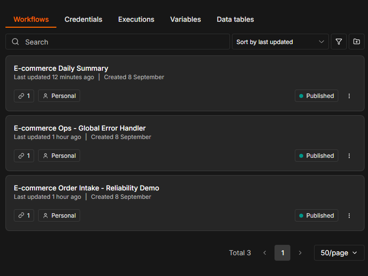
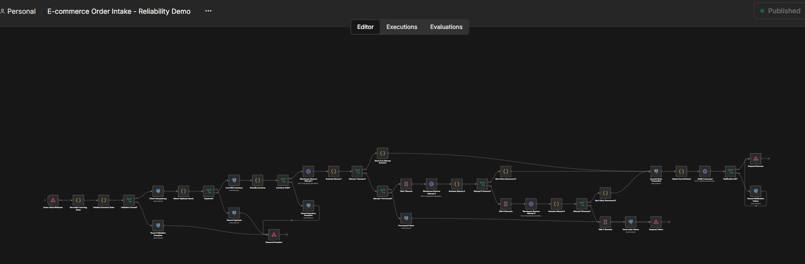
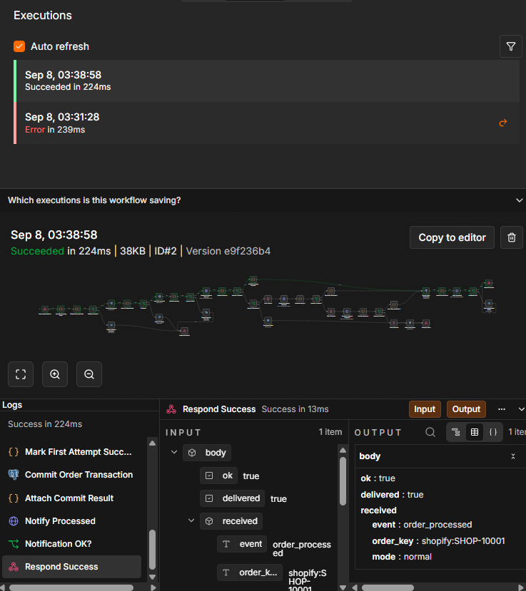
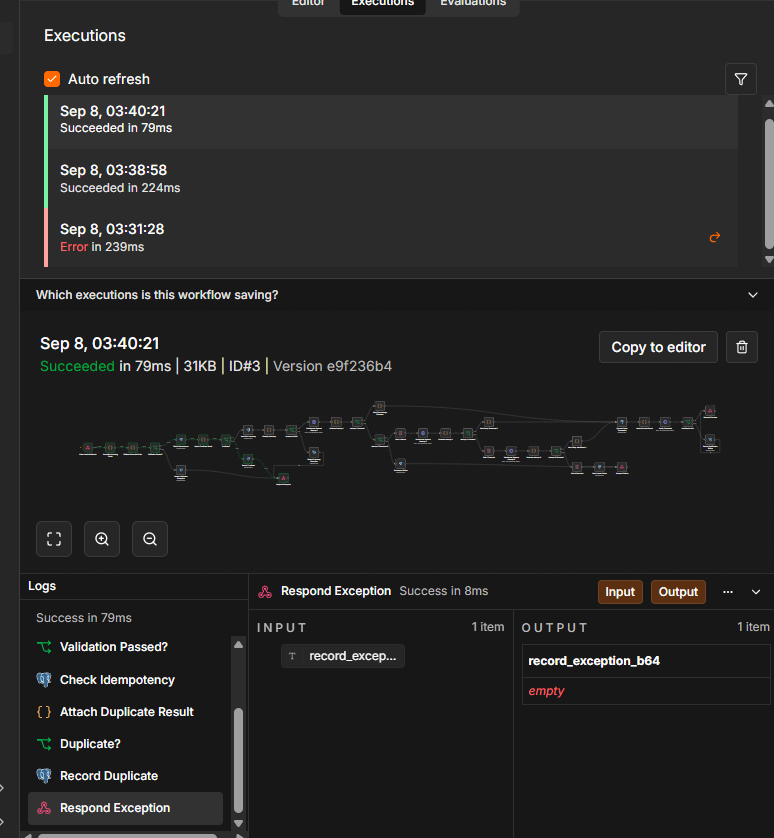
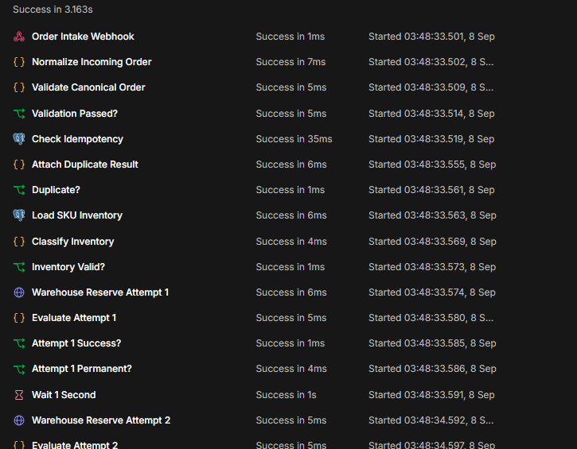
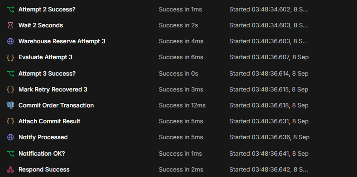
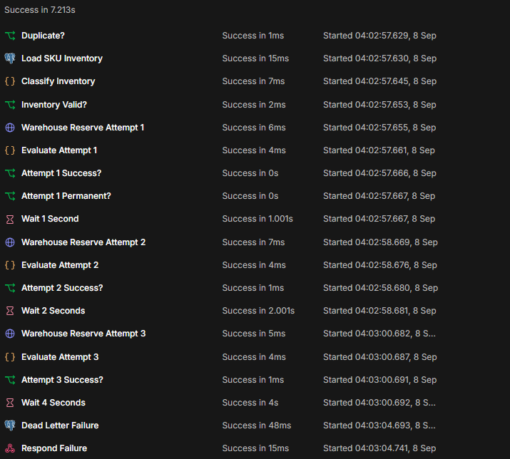
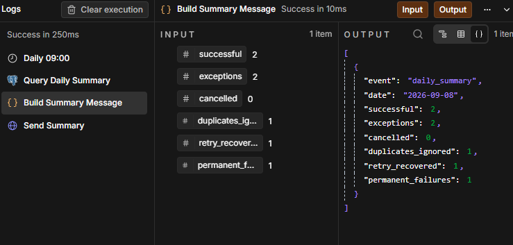
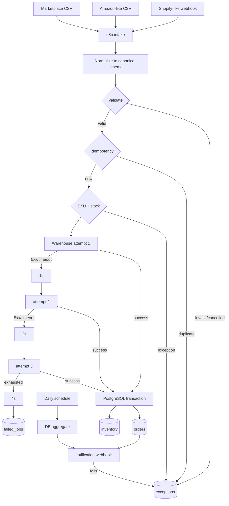

# E-commerce Order & Inventory Exception Automation

A production-oriented **n8n + PostgreSQL reliability portfolio** for multi-channel e-commerce operations.

The project is deliberately built around failure handling rather than only happy-path node chaining: canonical normalization, validation, idempotency, inventory safety, bounded retries, permanent-vs-temporary failure classification, dead-letter handling, transactional writes, exception audit trails, and a database-derived daily summary.

> **Synthetic data only.** Every order, email, SKU, inventory value, failure, and result in this repository is fabricated for demonstration. This repository makes no real-client, production-uptime, accounting, tax, or ROI claims.

## Visual proof

### Published n8n workflows

All three portfolio workflows are imported and published in the local Docker deployment.



### Full intake workflow

The main workflow covers normalization → validation → idempotency → inventory checks → warehouse integration → bounded retry → transactional commit → notification, with controlled exception and dead-letter branches.



## Verified execution paths

### 1. Normal order → committed and notified

A synthetic Shopify-like order reaches `Commit Order Transaction`, sends the processed notification, and returns a successful webhook response.



### 2. Duplicate delivery → idempotently ignored

The same order is delivered again. The workflow executes `Check Idempotency → Attach Duplicate Result → Duplicate? → Record Duplicate → Respond Exception` instead of mutating order or inventory state again.



### 3. Temporary warehouse failure → retry recovery

The deterministic mock warehouse fails twice and succeeds on the third attempt. The execution visibly passes through a 1-second wait and a 2-second wait before `Mark Retry Recovered 3`, transaction commit, notification, and success response.





### 4. Exhausted temporary failure → dead letter

The warehouse returns temporary failure for every attempt. The workflow follows bounded backoff `1s → 2s → 4s`, writes the failed job, and returns a controlled dead-letter response rather than silently dropping the order.



### 5. Database-derived daily summary

The scheduled workflow queries PostgreSQL for the current **Asia/Seoul** day and builds the summary from stored state rather than hard-coded demo values.



The screenshot reflects the local demonstration session at capture time. CI runtime-regression totals are independently generated from its own isolated synthetic scenario set.

## Problem

Multi-channel order operations commonly fail in ways that basic automations hide:

- different source columns and payload shapes
- duplicate webhooks / duplicate CSV rows
- cancelled orders mixed into paid orders
- missing or unknown SKUs
- invalid quantities and currencies
- insufficient warehouse stock
- temporary API 500 / timeout failures
- retries that accidentally create duplicate state
- successful DB writes followed by notification failure
- no exception queue or dead-letter trail
- summary reports that do not reconcile to stored data

This demo treats those conditions as explicit workflow states.

## Architecture



Detailed design: [`docs/architecture.md`](docs/architecture.md)

## Reliability features

- **Canonical schema:** explicit per-source mapping inside n8n.
- **Idempotency key:** `source + ':' + external_order_id`.
- **Defense in depth:** workflow pre-check plus `orders.order_key UNIQUE`.
- **Transactional inventory:** row lock, inventory decrement, and order insert occur inside one PostgreSQL function transaction.
- **Failure classification:** validation and integration 4xx failures are permanent; temporary 5xx/timeout-style failures use bounded retry.
- **Bounded retry chain:** attempt 1 → wait 1s → attempt 2 → wait 2s → attempt 3 → wait 4s → dead-letter.
- **Post-commit notification isolation:** notification failure records `NOTIFICATION_FAILURE` instead of rolling back a valid order.
- **Audit trail:** `exceptions`, `failed_jobs`, `processed_events`, and `workflow_runs`.
- **Global error workflow:** unexpected n8n execution errors route to a dedicated handler.
- **Database-derived summary:** daily totals are calculated from persisted state using `Asia/Seoul` day boundaries.

## Canonical order schema

```json
{
  "source": "shopify",
  "external_order_id": "SHOP-10001",
  "order_key": "shopify:SHOP-10001",
  "customer_email": "demo01@example.com",
  "sku": "SKU-RED-001",
  "quantity": 2,
  "unit_price": 10100,
  "currency": "KRW",
  "order_status": "paid",
  "created_at": "2026-09-01T09:00:00+09:00"
}
```

## Tech stack

- n8n **2.37.10** pinned Docker image
- PostgreSQL **17.11** pinned Alpine image
- Node.js 22 mock API
- TypeScript mock-service source with prebuilt JS runtime
- Python 3 standard-library deterministic smoke harness
- Docker Compose for reproducible local topology
- GitHub Actions for deterministic repository checks and live container regression

## Automated verification

### Deterministic 42-fixture harness

The repository includes 42 synthetic rows across Shopify-like, Amazon-like, and marketplace schemas.

Expected checks:

```text
Test A — Normal order: PASS
Test B — Duplicate webhook: PASS
Test C — Unknown SKU: PASS
Test D — Insufficient inventory: PASS
Test E — Temporary API failure: PASS
Test F — Permanent/exhausted API failure: PASS
Test G — Cancelled order: PASS
Test H — Re-run safety: PASS
Test I — Daily summary reconciliation: PASS
```

Verified deterministic totals:

| Metric | Result |
|---|---:|
| Fixture rows | 42 |
| Orders processed | 26 |
| Exceptions | 17 |
| Cancelled | 3 |
| Duplicates ignored | 2 |
| Retry recovered | 1 |
| Dead-letter jobs | 2 |

The re-run safety check verifies that replaying the dataset does not change committed order count or inventory state.

### Live n8n + PostgreSQL regression

GitHub Actions also starts the real Docker Compose topology and verifies **n8n 2.37.10 + PostgreSQL 17.11** end to end with ephemeral credentials.

Covered paths include:

- runtime version and database initialization checks
- credential import
- all three workflow imports with exact IDs/names
- workflow publication/activation
- normal order processing
- duplicate suppression
- unknown SKU and insufficient-stock handling
- temporary failure recovery
- exhausted 500-style failure → dead letter after 3 attempts
- permanent 400-style failure → dead letter without retry
- cancelled-order handling
- re-run safety
- database-derived Daily Summary reconciliation
- `Asia/Seoul` calendar-date reconciliation
- global error-workflow binding
- PostgreSQL compatibility-log check
- runtime evidence artifact upload

The focused runtime scenario set reconciles to:

| Metric | Result |
|---|---:|
| Successful | 2 |
| Exceptions | 7 |
| Cancelled | 1 |
| Duplicates ignored | 2 |
| Retry recovered | 1 |
| Permanent failures / dead-letter jobs | 2 |

See [`docs/test-results.md`](docs/test-results.md) for the evidence boundary and historical baseline.

## Quick start

### Deterministic smoke test — Windows PowerShell

```powershell
cd n8n-ecommerce-ops-automation
Set-ExecutionPolicy -Scope Process Bypass
.\scripts\run-smoke.ps1
```

### Deterministic smoke test — macOS / Linux / Git Bash

```bash
cd n8n-ecommerce-ops-automation
./scripts/run-smoke.sh
```

### Full Docker deployment

1. Create the local environment file:

```powershell
Copy-Item .env.example .env
```

2. Set real local values for at least `POSTGRES_PASSWORD` and `N8N_ENCRYPTION_KEY`.

3. Start the topology:

```powershell
docker compose up -d
```

4. Open n8n at `http://localhost:5678/`.

5. Import workflows:

```powershell
Set-ExecutionPolicy -Scope Process Bypass
.\scripts\import-workflows.ps1
```

6. Create one **Postgres** credential in n8n:

```text
Host: postgres
Port: 5432
Database: ecommerce_ops
User: ecommerce_ops
Password: <POSTGRES_PASSWORD from local .env>
SSL: Disable
```

Attach it to all Postgres nodes. Workflow JSON intentionally contains no credential ID, password, or API key.

7. Set `E-commerce Ops - Global Error Handler` as the error workflow for the intake workflow and publish all three workflows.

8. Send one synthetic fixture:

```powershell
.\scripts\send-webhook.ps1
```

## PostgreSQL 16 → 17 local demo reset

The upgrade intentionally uses a new Compose volume key, `postgres17_data`. This prevents a PostgreSQL 17 server from opening a PostgreSQL 16 data directory.

Because this repository contains synthetic demo data, the PostgreSQL 17 volume is initialized from `db/schema.sql` and `db/seed.sql`. This is **not** presented as a production database migration strategy; a real migration should use PostgreSQL-supported dump/restore or `pg_upgrade` procedures as appropriate.

## Exception codes

| Code | Meaning | Retry |
|---|---|---:|
| `DUPLICATE_ORDER` | already processed idempotency key | No |
| `ORDER_CANCELLED` | cancelled/canceled order | No |
| `MISSING_FIELD` | required canonical field absent | No |
| `MALFORMED_EMAIL` | invalid email shape | No |
| `MALFORMED_INPUT` | malformed numeric/input row | No |
| `UNKNOWN_SKU` | SKU not in master | No |
| `INVALID_QUANTITY` | quantity <= 0 | No |
| `INSUFFICIENT_STOCK` | stock lower than requested quantity | No |
| `INVALID_CURRENCY` | unsupported currency | No |
| `API_TEMPORARY_FAILURE` | temporary integration failure exhausted | Yes, bounded |
| `API_PERMANENT_FAILURE` | non-retryable integration response | No |
| `NOTIFICATION_FAILURE` | downstream notification failed after DB commit | Separate follow-up |
| `WORKFLOW_EXECUTION_FAILURE` | unexpected n8n execution error | Error workflow |

## Security notes

- No credential IDs, tokens, API keys, or customer data are intended to be committed.
- `.env` is ignored; `.env.example` contains placeholders only.
- CI creates temporary random database/encryption credentials and destroys the runtime afterward.
- SQL business inputs use query parameters.
- Webhook authentication/signature verification is a **production requirement** and intentionally documented rather than faked in the local mock.
- Raw payload retention and PII redaction must be adapted to customer requirements.
- Screenshot evidence intentionally avoids credential panels and secret values.

## Limitations

- The warehouse and notification integrations are deterministic local mocks, not real merchant APIs.
- CSV ingestion is row-based in the demo; a customer delivery would usually ingest/download files from the source system, object storage, or SFTP according to the real contract.
- Manual review is represented by structured exception records/status fields; a customer-specific admin UI is outside this portfolio scope.
- The current n8n container can emit a Python task-runner availability warning. Verified paths use JavaScript Code nodes; deployments requiring Python task runners should configure the appropriate production runner topology.
- This repository does not claim production merchant experience, production uptime, settlement correctness, accounting/tax correctness, or financial ROI.

## Portfolio materials

- [`screenshots/README.md`](screenshots/README.md) — verified UI evidence catalog
- [`docs/architecture.md`](docs/architecture.md)
- [`docs/failure-scenarios.md`](docs/failure-scenarios.md)
- [`docs/test-results.md`](docs/test-results.md)
- [`docs/repository-audit.md`](docs/repository-audit.md)
- [`docs/portfolio-case-study.md`](docs/portfolio-case-study.md)
- [`docs/demo-video-script.md`](docs/demo-video-script.md)
- [`docs/application-intro.md`](docs/application-intro.md)
