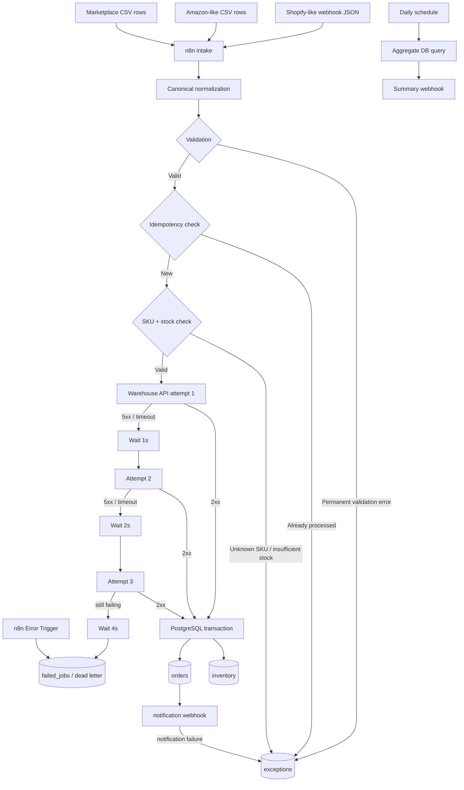

# Architecture

All business and customer data in this repository is synthetic.

## Reliability boundaries

1. **Normalization boundary** — source-specific payloads become one canonical order contract.
2. **Validation boundary** — non-retryable business errors are rejected before integrations.
3. **Idempotency boundary** — application-level lookup plus `orders.order_key UNIQUE` protects against duplicate deliveries and concurrent races.
4. **Inventory boundary** — `reserve_inventory_and_insert_order*()` locks inventory and updates stock + order atomically.
5. **Integration boundary** — retryable warehouse failures use bounded exponential backoff; exhausted retries go to `failed_jobs`.
6. **Notification boundary** — downstream alert failure does not roll back a successfully committed order; it creates `NOTIFICATION_FAILURE` for manual follow-up.
7. **Audit boundary** — `exceptions`, `failed_jobs`, `processed_events`, and `workflow_runs` retain operational evidence.

## Production mapping

The local Docker topology uses PostgreSQL 16. The schema is intentionally Supabase-compatible because Supabase exposes PostgreSQL. In a real delivery, the n8n Postgres credential should point to the customer's Supabase/PostgreSQL instance rather than hard-coding connection data in the workflow JSON.
